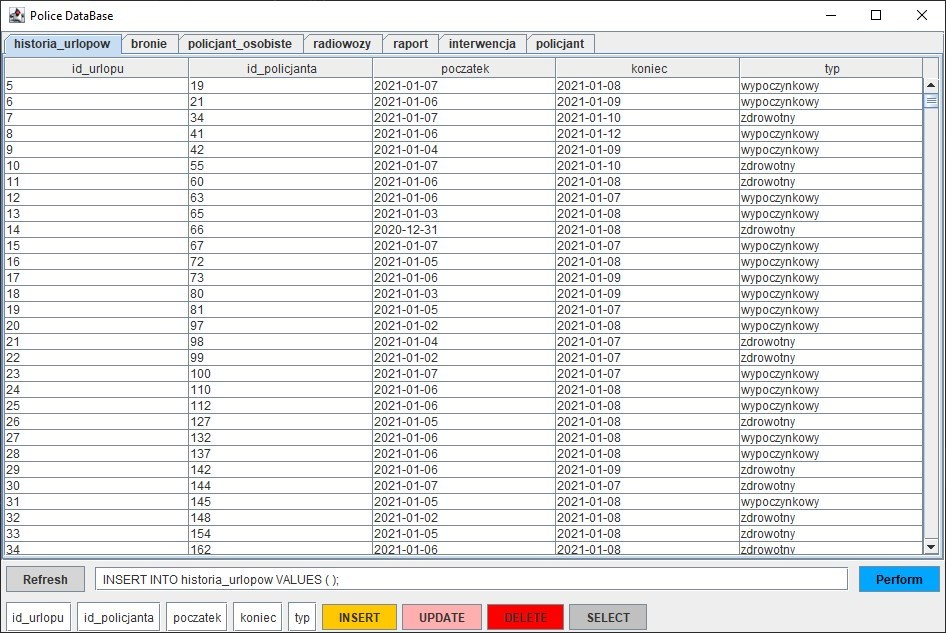

# Query-Tool
Query Tool for Postgres databases using Java and Swing

## Description
Program generates JPanel for every public table in database, then inside JPanel it generates JTable with every row and column.

## Technologies
* Postgresql JDBC driver: 42.2.18
* Java: 1.8.0_275

## Use

Look into Interface.java class and insert correct database url.

e.g.
```
static final String JDBC_DRIVER = "org.postgresql.Driver";
static final String DB_URL = "jdbc:postgresql://localhost/pgAdmin";
static final String USER = "admin";
static final String PASS = "admin";
```

Program will generate tables dynamically.



You might notice an input under the table, it allows you to under query command and will perform it.


